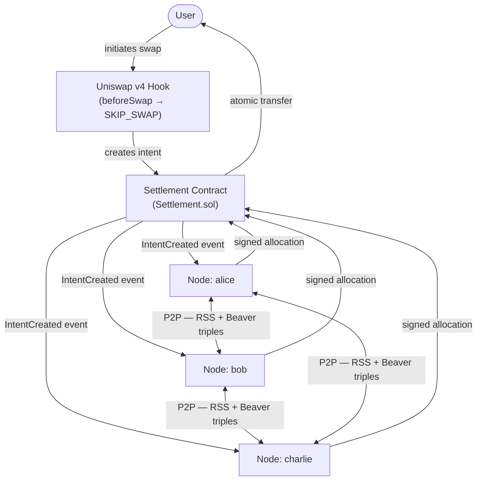

# VeilSwap

> [!NOTE]
> 🏆 [**HackMoney 2026**](https://ethglobal.com/showcase/veilswap-2y9sd) — Uniswap Foundation Uniswap v4 Privacy DeFi **2nd Place** · ENS Prize Pool
>
> _See also: [project write-up](https://hackmd.io/@ultraviolet1000/HyVZnGgdZl)_

VeilSwap is a privacy-preserving distributed liquidity protocol built on Uniswap v4. It addresses two critical DeFi vulnerabilities — concentration risk and information leakage — by combining Uniswap v4 hooks, multi-party computation, and atomic onchain settlement to enable liquidity provision across distributed nodes while keeping individual LP capacities private.

## Key Concepts

**[Uniswap v4 Hook](https://docs.uniswap.org/contracts/v4/overview):**
The hook intercepts swaps at the pool level via the `beforeSwap` callback. Rather than executing through the standard AMM mechanism, it creates an intent and hands it off to the offchain MPC coordination layer, returning `SKIP_SWAP` so the pool treats the transaction as handled.

**MPC Node Network:**
N distributed servers jointly compute allocation decisions using 3-party Replicated Secret Sharing (RSS), Beaver triples, and arithmetic circuits — without revealing individual liquidity capacities to one another. Each server learns only its own allocation while the network collectively verifies total capacity and calculates proportional splits.

**Settlement Contract:**
The onchain contract verifies signatures from all MPC servers, confirms allocations sum to the order size, and executes atomic transfers. The contract either executes all pulls and the swap, or reverts entirely — with nonce-based replay protection ensuring each intent is settled exactly once.

## System Architecture



## Monorepo Structure

- `contracts/` — Foundry smart contracts (`Settlement.sol`)
- `apps/node/` — MPC node service (TypeScript, Uniswap v4 auto-swap)
- `apps/web/` — Next.js web app (Wagmi + Viem)

## Quick Start

```bash
pnpm install
pnpm build
```

### Web App

```bash
pnpm dev
```

Open `http://localhost:3000`.

### Node (MPC)

```bash
cd apps/node
pnpm install
pnpm build
cp .env.example .env
pnpm start
```

### Contracts

```bash
cd contracts
forge build
forge test
```

## Environment

Use `.env` files per package.

- `apps/node/.env` for MPC nodes
- `apps/web/.env.local` for web app
- `contracts/.env` (optional) for Foundry scripts

## Further Reading

- [contracts/README.md](contracts/README.md) — contract details and scripts
- [apps/node/README.md](apps/node/README.md) — MPC node setup and protocol
- [apps/web/README.md](apps/web/README.md) — web app setup and dev workflow
